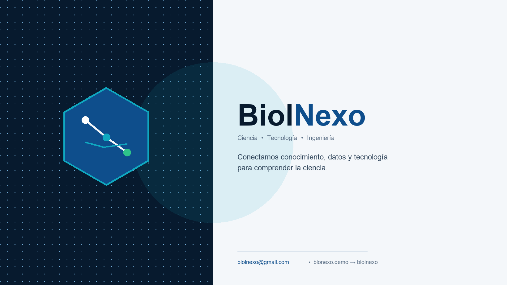

# BiolNexo — Viral Biotech in 4 Minutes

> CRISPR in 4 min, strawberry DNA in 10, weekly trends + health apps. No jargon, with sources, ready to share on class and socials.



**Live:** https://biolnexo.vercel.app · **Contact:** [biolnexo@gmail.com](mailto:biolnexo@gmail.com) · **Facebook:** https://web.facebook.com/profile.php?id=61594219768551

## Why BiolNexo

- **Students:** experiment-friendly protocols (≤6 steps, household materials, YouTube) + `Educativo/Supervisado` safety cards.
- **Curious:** 4-min trend briefings — hook, what happened, why it matters, what's next.
- **Pros:** `TierBadge` traceability — `Investigación publicada` / `Interpretación BiolNexo` / `Divulgación científica` with DOI + references on every article.

## 4 Areas (no sprawl)

| Slug | Name | Tagline |
|---|---|---|
| `biotecnologia` | Biotecnología | Science that you get and share — no jargon |
| `tendencias` | Tendencias | What's moving in bio this week — 4 min |
| `experimentos-caseros` | Experimentos caseros | Do it yourself, safe and visual |
| `software-salud` | Software & Salud | Apps that measure your health |

Legacy 7 slugs (`biologia`, `bioinformatica`, `ia-cientifica`, etc.) redirect via `LEGACY_SLUG_MAP` (`src/types.ts:19`) — no broken links.

## Stack

- **Frontend:** React 18 + Vite 6 + Tailwind CSS 4 + React Router `BrowserRouter` + Framer Motion + Recharts
- **Manager:** `pnpm` `10.29.3` (`packageManager` field, `pnpm-lock.yaml`)
- **Data:** Typed `src/types.ts` → `Article / Category / Experiment / Dataset / Publication / SoftwareProject` + `BodyBlock` (`h2/p/list/quote/image/table/sequence/note`)
- **Viz:** `HeroViz` DNA + `ConsoleFrame`/`CostChart`/`GrowthArea`/`PhyloTree`/`AlignmentViz`
- **Share:** Manual X / Facebook / LinkedIn / WhatsApp + copy for Instagram/TikTok (no API)
- **Brand:** `public/brand/` profile 1024 + cover 1640×924 + SVG, generated by `scripts/generate-brand.py` (Pillow)

## Structure

```
src/
  components/  Header, Footer, HeroViz, Viz, Cards (incl. SoftwareCard), ui (TierBadge/Stat), icons
  pages/       Home, Category, Article, Search, Platforms, Static, Software
  pages/admin/ AdminLayout, Dashboard, AdminLogin (magic-link), Articles (blocks editor), SoftwareAdmin, Experiments, Categories, Media, Placeholder
  lib/         supabase.ts (isSupabaseConfigured + NEXT_PUBLIC compat)
  data/        content.ts (12 articles, 5 experiments, 6 datasets, 3 software) + fetch híbrido
supabase/
  migrations/  20260906 drafts → 20260907 backend 4 slugs → 20260908 fix RLS → 20260910 anon demo → 20260912 RLS prod (editor only) → 20260913 storage covers
  combined.sql (all)
scripts/       generate-brand.py, agent_draft.py (gemini-2.5-flash-lite free, 3×/week)
public/brand/  profile/cover PNG/WebP + SVG
api/cron/agent.js  Vercel Cron placeholder
vercel.json    rewrites SPA + crons placeholder
```

## Quickstart

```bash
pnpm install
pnpm dev       # http://localhost:3000
pnpm build     # vite build -> dist/
pnpm typecheck
```

Copy ` .env.example` → `.env` and fill `VITE_SUPABASE_URL` / `VITE_SUPABASE_ANON_KEY` / `VITE_SITE_URL`. Never commit `.env` (ignored).

## Backend

- **Tables:** `categories` (4), `articles` (Article + `body`/`references` jsonb), `software_projects`, `drafts` (`pending_review`), `draft_reviews`, `sources` + `storage.buckets` `covers` (public).
- **RLS:** Demo allows anon `pending_review` reads; prod `20260912_rls_prod.sql` restricts writes to `auth.jwt() ->> 'email' = 'biolnexo@gmail.com'`. Public read stays for `articles/categories/software`.
- **Storage:** bucket `covers` public, RLS `editor write` on `storage.objects`. Regenerate with `supabase/combined.sql` in SQL Editor.

## Admin

`/admin/login` → magic-link only `biolnexo@gmail.com` ( Supabase Auth, `VITE_SITE_URL` redirect). Layout `bg-navy` sidebar (no public Header/Footer).

- **Dashboard** `/admin` — stats live (categories/software/articles/drafts) + flow 1-2-3.
- **Borradores** `/admin/borradores` — list `drafts pending_review` with preview `BodyBlock` + DOI, **Approve & publish** → inserts `articles` + `draft_reviews`, **Reject**.
- **Artículos** `/admin/articulos` — CRUD with block editor (h2/p/list/quote/image/table/sequence/note, reorder ↑↓, image URL or file → `covers`).
- **Software** `/admin/software` — `titulo/resumen/coverImage/videoUrl/downloadUrl/repoUrl/stack/areaSalud/destacado` (cover URL or file).
- **Experimentos / Categorías / Medios / Ajustes** — CRUD + media library (`covers` list, copy URL, **Change** overwrites same path and updates linked, **Delete** replaces linked with fallback `/brand/biolnexo-cover-1640x924.png`).

## Agent (free tier)

Free `GEMINI_API_KEY` (aistudio.google.com) + `GEMINI_MODEL=gemini-2.5-flash-lite` (~60 req/min, ~1M tokens/day, resets daily). No billing needed for 3 drafts/week (~6-8k tokens each).

- **Prompt:** `area: biotecnologia|tendencias|experimentos-caseros|software-salud` + `lang: es` + `SOURCES` DOI + strict `BodyBlock` JSON, `tier` forced to `Divulgación` if no DOI.
- **Flow:** `scripts/agent_draft.py` → `drafts pending_review` → human approve in `/admin/borradores` → `articles` live → manual share.
- **Schedule:** 3×/week Mon/Wed/Fri 06:00 UTC via `vercel.json` crons placeholder + `api/cron/agent.js` (logs) — production generation recommended via external scheduler with `LLM_ENABLED=true`.

## Deploy — Vercel

1. Import `JhonyLezama/biolnexo` → Framework **Vite**
2. Build: `pnpm build` → Output: `dist`
3. Env (Production): `VITE_SUPABASE_URL`, `VITE_SUPABASE_ANON_KEY`, `VITE_SITE_URL` (e.g. `https://biolnexo.vercel.app`)
4. `vercel.json` rewrites SPA + crons placeholder → auto deploy on `main`.

## Brand Kit

In `public/brand/`:

- `biolnexo-profile-1024.png` / `.webp` — Facebook profile (circular crop)
- `biolnexo-cover-1640x924.png` / `.webp` — Facebook cover
- `biolnexo-logo-mark.svg` / `biolnexo-logo-full.svg`

Regenerate: `python scripts/generate-brand.py` (Pillow).

## License

Demo articles `CC BY-NC 4.0`. Code private.

— BiolNexo, viral biotech that you can share.
